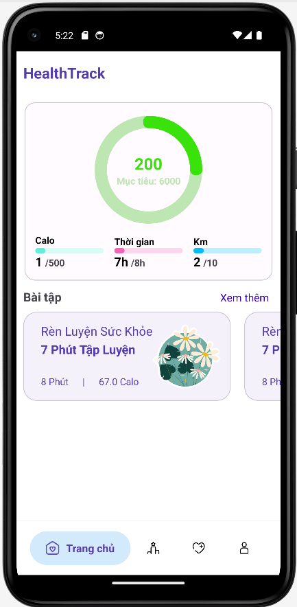

# Portfolio
---
## SGU Social

Build a social network called SGU Social as a miniature Facebook, including functions such as create accounts, add friends, message, post statuses, edit information and many other functions.

Login page

Home page

Profile page

---

## Health Track

Build a mobile app called Health Track inspired by Samsung Health, including functions such as create accounts, add friends, especially counting footstep, track calories, participate challenges with friends, set footstep target, and other functions

Home page

Challenges page

Profile page

## RSS Reader

Build mobile applications to help users read news online more easily. The application displays in a list of categories. When the user chooses to view a news by clicking on the title, there will be a notification dialog displaying a summary of the content and images.

Home page

List page

Demo page

---

© 2024 Doan Toan. Powered by Jekyll and the Minimal Theme.

